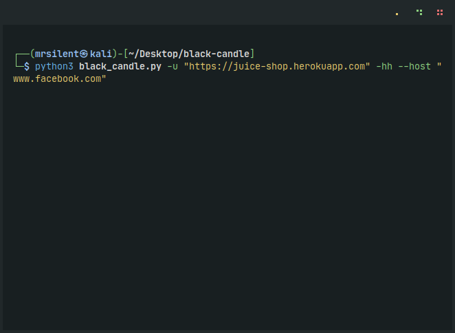

# Black Candle


## How to Install the Tool

### Download the Tool

If you are using Linux, open your terminal, make sure Git is installed, and then write:
```
git clone https://github.com/mrsi13nt/black-candle.git
```
But if you are using Windows, you have two options:
1. Download the whole tool as a file from GitHub.
2. Download Git on your Windows, open your Git terminal, and follow the steps for Linux.

### Install the Tool

Now, from your terminal, make sure you are in the tool's folder and then run this command:
```
pip3 install -r requirements.txt
```
**Warning:** Before you run this command, make sure you have Python3 installed. If not, you can download it from [here](#).

## Black Candle Options

| Option       | Description                                                    |
|--------------|----------------------------------------------------------------|
| `-u, --url`  | Target URL (e.g. "http://www.site.com/vuln.php?id=1")         |
| `--data`     | Data string to be sent through POST (e.g. "data=1")           |
| `-p, --payload` | You can add custom payload                                  |
| `-hh`        | Run host header injection scanner                             |
| `--host`     | Add custom host header (e.g. --host "www.ping.com")           |
| `-js`        | Scan all JavaScript files of the full website for API keys and more. |
| `-rf`        | Scan for reflected XSS                                        |
| `-d`         | Scan for DOM XSS                                              |
| `-b`         | Scan for blind XSS                                            |
| `-o`         | File to write output to                                       |

## Features

### SQLi

* SQLi scanner will run automatically when you input the URL with data or the URL with a payload.
  - `data` is a specific parameter you want to scan like "id=2". This is exactly what you will write after switch `--data`.
  - `payload` is an option that allows you to add a custom payload you want to scan.
* You can use both switches in the same command line.


### Host Header Injection

* SQLi scanner will run automatically when you input the URL with data or the URL with a payload.
  - `data` is a specific parameter you want to scan like "id=2". This is exactly what you will write after switch `--data`.
  - `payload` is an option that allows you to add a custom payload you want to scan.
* You can use both switches in the same command line.


### JavaScript Scanner

* SQLi scanner will run automatically when you input the URL with data or the URL with a payload.
  - `data` is a specific parameter you want to scan like "id=2". This is exactly what you will write after switch `--data`.
  - `payload` is an option that allows you to add a custom payload you want to scan.
* You can use both switches in the same command line.


### XSS

* SQLi scanner will run automatically when you input the URL with data or the URL with a payload.
  - `data` is a specific parameter